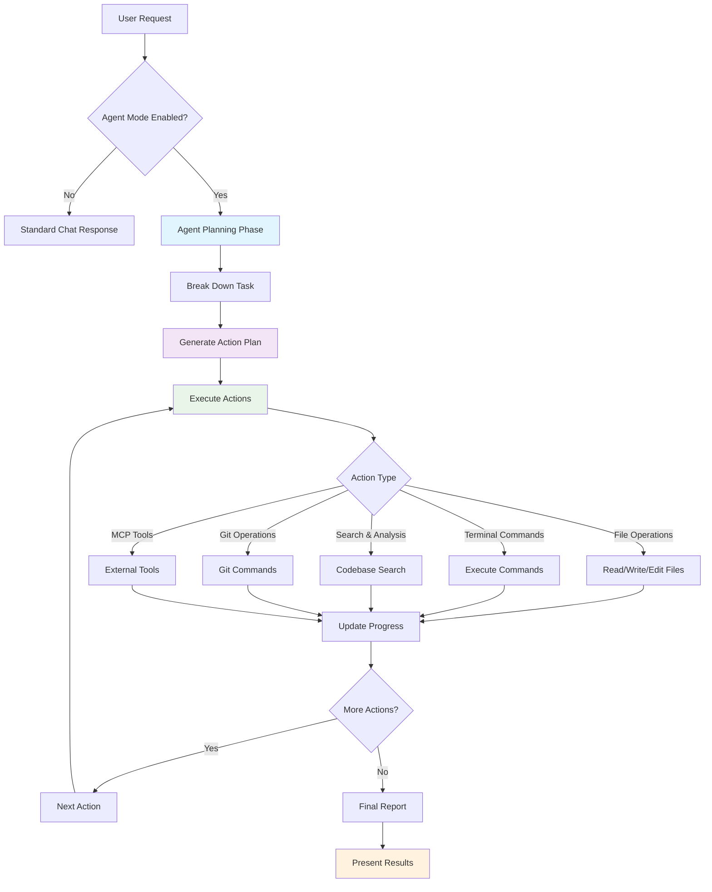

# 🤖 Full Agent Mode

**Cuovare's flagship feature** - Transform Cuovare from a chat assistant into an autonomous AI agent capable of performing complex, multi-step development tasks without constant supervision.

## Overview

Full Agent Mode enables Cuovare to operate autonomously, breaking down complex requests into actionable plans and executing them step-by-step. Unlike traditional chat-based AI assistants, Agent Mode can perform real work in your codebase: reading files, making changes, running commands, and managing your development workflow.



## 🚀 Getting Started

### Enabling Agent Mode

1. **Visual Toggle**: Click the purple robot icon (🤖) in the chat header
2. **Status Indicator**: The button will glow purple when active
3. **Confirmation**: You'll see a system message confirming the mode change

### Example Requests

Agent Mode excels at complex, multi-step tasks:

**🔧 Code Refactoring**
```
"Refactor the authentication system to use JWT tokens instead of sessions"
```

**📁 Project Setup**
```
"Create a new React component with TypeScript, add unit tests, and update the main export"
```

**🐛 Bug Investigation**
```
"Find and fix the memory leak in the data processing pipeline"
```

**📚 Documentation**
```
"Generate comprehensive API documentation for all public methods in the services directory"
```

## 🎯 Core Capabilities

### File Operations
- **Read**: Analyze existing code and configurations
- **Write**: Create new files with generated content
- **Edit**: Modify existing files with precise changes
- **Create**: Generate entire project structures
- **Delete**: Clean up unused or deprecated files

### Terminal Commands
- **Build Scripts**: Run compilation and build processes
- **Testing**: Execute test suites and generate reports
- **Package Management**: Install dependencies and manage versions
- **Development Tools**: Run linters, formatters, and analyzers

### Codebase Analysis
- **Intelligent Search**: Find relevant code across the entire project
- **Dependency Mapping**: Understand component relationships
- **Pattern Recognition**: Identify architectural patterns and anti-patterns
- **Impact Analysis**: Assess the effects of proposed changes

### Git Operations
- **Commit Generation**: Create meaningful commit messages
- **Branch Management**: Create, switch, and merge branches
- **Change Tracking**: Monitor modifications and conflicts
- **History Analysis**: Review project evolution and changes

### MCP Tool Integration
- **Database Access**: Query and modify database contents
- **External APIs**: Interact with web services and APIs
- **File System**: Advanced file operations beyond basic read/write
- **Custom Tools**: Extend capabilities with your own MCP servers

## 🛠️ How It Works

### 1. Planning Phase
When you make a request in Agent Mode, Cuovare:
- Analyzes your request for complexity and requirements
- Gathers relevant context from your codebase
- Creates a detailed execution plan with specific steps
- Validates the plan against available capabilities

### 2. Execution Phase
The agent executes the plan step-by-step:
- **Sequential Processing**: Each action builds on previous results
- **Real-time Updates**: Progress is reported as actions complete
- **Error Handling**: Graceful recovery from failures
- **Adaptive Behavior**: Plan adjustments based on intermediate results

### 3. Reporting Phase
After execution:
- **Comprehensive Summary**: Detailed report of all actions taken
- **Success Metrics**: Clear indication of completed vs. failed tasks
- **Next Steps**: Recommendations for follow-up actions
- **File Changes**: Summary of all modifications made

## 📊 Progress Tracking

### Visual Indicators
- **🧠 Planning**: Agent is analyzing your request
- **🎬 Executing**: Actions are being performed
- **✅ Completed**: Task finished successfully
- **❌ Failed**: Error occurred (with details)
- **⏸️ Paused**: Waiting for user input or confirmation

### Detailed Logs
Agent Mode provides comprehensive logging:
- **Action Descriptions**: What each step accomplishes
- **Execution Time**: How long each action takes
- **Success/Failure Status**: Clear outcome indicators
- **Error Messages**: Detailed failure information
- **Context Information**: Relevant files and data used

## ⚙️ Configuration

### Capability Control
Fine-tune what the agent can do:

```json
{
  "fileOperations": true,
  "terminalCommands": true,
  "gitOperations": true,
  "mcpTools": true,
  "webSearch": true,
  "codebaseAnalysis": true
}
```

### Safety Settings
- **Confirmation Prompts**: Require approval for destructive actions
- **File Restrictions**: Limit access to specific directories
- **Command Filtering**: Block potentially dangerous terminal commands
- **Backup Creation**: Automatically backup files before modification

## 🔒 Security & Safety

### Built-in Protections
- **Workspace Boundaries**: Agent operates only within your project
- **Permission Validation**: Checks file and command permissions
- **Error Recovery**: Automatic rollback on critical failures
- **User Oversight**: Stop execution at any time

### Best Practices
1. **Start Small**: Begin with simple tasks to understand agent behavior
2. **Version Control**: Always work in a git repository for easy rollbacks
3. **Review Changes**: Examine agent modifications before committing
4. **Monitor Progress**: Watch execution logs for unexpected behavior

## 🚨 Troubleshooting

### Common Issues

**Agent Mode Won't Enable**
```
Check that all required capabilities are available:
- Workspace folder is open
- File permissions are correct
- Terminal access is enabled (if needed)
```

**Actions Failing**
```
Review the detailed error logs in output channel:
View → Output → "Cuovare Agent Mode"
```

**Unexpected Behavior**
```
Stop execution immediately:
- Click the purple robot icon to disable
- Use Ctrl+C in terminal if commands are running
- Check git status for uncommitted changes
```

### Debug Commands

Use the Command Palette (`Ctrl+Shift+P`):
- **Cuovare: Debug MCP Servers** - Check tool availability
- **Cuovare: Agent Mode Status** - View current agent state
- **Developer: Reload Window** - Reset if agent becomes unresponsive

## 📈 Performance Tips

### Optimization Strategies
1. **Context Relevance**: Agent works better with focused, specific requests
2. **Project Structure**: Well-organized codebases enable better analysis
3. **Clear Requirements**: Detailed requests produce better execution plans
4. **Incremental Work**: Break massive tasks into smaller agent requests

### Resource Management
- **File Limits**: Agent processes up to 50 files per analysis by default
- **Memory Usage**: Large codebases may require increased memory allocation
- **Network Access**: MCP tools may need internet connectivity
- **Disk Space**: Ensure sufficient space for temporary files and backups

## 🔮 Advanced Usage

### Custom Workflows
Create sophisticated development workflows:

```typescript
// Example: Automated Feature Development
const featureRequest = `
Create a new user authentication feature:
1. Design the database schema
2. Implement the API endpoints
3. Create the frontend components
4. Add comprehensive tests
5. Update documentation
6. Generate migration scripts
`;
```

### Integration Patterns
Combine Agent Mode with other Cuovare features:
- **MCP Tools**: Extend agent capabilities with custom tools
- **Git Integration**: Automated branch and commit management
- **Context Engine**: Leverage intelligent codebase understanding
- **Multi-Provider AI**: Use different models for different tasks

### Batch Operations
Process multiple related tasks:
```
"Refactor all React class components in /src/components to functional components with hooks"
```

## 🤝 Contributing

### Extending Agent Capabilities
Add new action types by implementing the action execution interface:

```typescript
private async executeCustomAction(payload: any): Promise<string> {
    // Your custom action logic here
    return 'Custom action completed';
}
```

### Action Type Development
1. **Define Action Interface**: Specify input/output contracts
2. **Implement Executor**: Create the action execution logic
3. **Add Error Handling**: Ensure graceful failure recovery
4. **Update Planning**: Teach the agent when to use your action
5. **Test Thoroughly**: Validate across different scenarios

### Capability Extensions
- **New Tool Categories**: Database tools, cloud services, CI/CD
- **Enhanced Planning**: More sophisticated decision-making algorithms
- **Better Context**: Improved codebase understanding and analysis
- **User Interface**: Enhanced progress visualization and control

## 📚 API Reference

### Core Classes

#### `AgentMode`
Main agent orchestration and execution engine.

#### `AgentPlan`
Represents an execution plan with ordered actions.

#### `AgentAction`
Individual executable task within a plan.

#### `AgentCapabilities`
Configuration object defining what the agent can do.

### Key Methods

- `setEnabled(boolean)`: Enable/disable agent mode
- `executeAgentRequest(string, context?)`: Execute a user request
- `getCurrentPlan()`: Get the current execution plan
- `stopExecution()`: Halt current execution
- `getCapabilities()`: Get available agent capabilities

## 🎉 Success Stories

### Real-World Examples

**Large-Scale Refactoring**
> "Agent Mode helped us migrate our entire codebase from JavaScript to TypeScript in 2 hours instead of 2 weeks."

**Test Coverage Improvement**
> "The agent automatically generated unit tests for 200+ components, increasing our coverage from 40% to 95%."

**Documentation Generation**
> "Created comprehensive API documentation for our entire service layer, including examples and type definitions."

**Bug Resolution**
> "Agent Mode traced through complex data flows to identify and fix a race condition that had been plaguing production."

---

## 🔗 Related Documentation

- [MCP Enhanced Guide](MCP_ENHANCED_GUIDE.md) - External tool integration
- [Development Guide](DEVELOPMENT.md) - Contributing to Cuovare
- [Testing Guide](TESTING.md) - Quality assurance practices

---

**Ready to experience autonomous AI development?** Enable Agent Mode and transform how you code! 🚀
