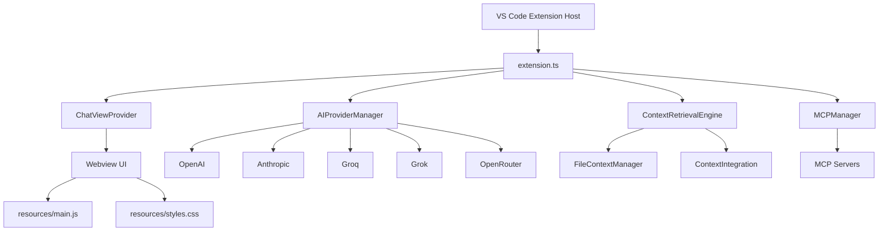

# 🛠️ Cuovare Development Guide

This guide covers everything you need to know to develop, build, and contribute to Cuovare.

## 📋 Table of Contents

- [Prerequisites](#prerequisites)
- [Project Setup](#project-setup)
- [Development Workflow](#development-workflow)
- [Architecture Overview](#architecture-overview)
- [Core Components](#core-components)
- [Build System](#build-system)
- [Debugging](#debugging)
- [Performance](#performance)
- [Security Guidelines](#security-guidelines)

## 🔧 Prerequisites

### Required Software

```bash
# Node.js (18.0 or higher)
node --version  # Should be 18.0+

# pnpm (recommended package manager)
npm install -g pnpm
pnpm --version  # Should be 8.0+

# VS Code (1.100.0 or higher)
code --version  # Should be 1.100.0+

# Git
git --version
```

### Recommended VS Code Extensions

```json
{
  "recommendations": [
    "ms-vscode.vscode-typescript-next",
    "dbaeumer.vscode-eslint",
    "esbenp.prettier-vscode",
    "bradlc.vscode-tailwindcss",
    "ms-vscode.test-adapter-converter"
  ]
}
```

## 🚀 Project Setup

### 1. Clone and Install

```bash
# Clone the repository
git clone https://github.com/your-org/cuovare.git
cd cuovare

# Install dependencies
pnpm install

# Verify installation
pnpm run compile
```

### 2. Environment Setup

```bash
# Copy environment template
cp .env.example .env.local

# Configure your development settings
# Add test API keys for development
```

### 3. VS Code Configuration

```bash
# Open in VS Code
code .

# Install recommended extensions when prompted
# Configure your settings.json if needed
```

## 🔄 Development Workflow

### Daily Development

```bash
# Start development mode
pnpm run watch          # Compiles TypeScript in watch mode

# In VS Code, press F5 to launch Extension Development Host
# This opens a new VS Code window with your extension loaded

# Make changes to code → Reload extension window to test
# Ctrl+R (Windows/Linux) or Cmd+R (Mac) in Extension Development Host
```

### Available Scripts

```bash
# Development
pnpm run compile        # Compile TypeScript once
pnpm run watch          # Compile TypeScript in watch mode
pnpm run dev            # Development mode with auto-reload

# Testing
pnpm run test           # Run all tests (VS Code integration tests)
pnpm run unit-tests     # Run unit tests only (fast)
pnpm run test:watch     # Run tests in watch mode
pnpm run test:coverage  # Generate test coverage report

# Code Quality
pnpm run lint           # Run ESLint
pnpm run lint:fix       # Fix ESLint issues automatically
pnpm run format         # Format code with Prettier
pnpm run typecheck      # Type check without compilation

# Building
pnpm run build          # Production build
pnpm run package        # Create .vsix package for distribution
pnpm run vscode:prepublish  # Prepare for VS Code marketplace

# Utilities
pnpm run clean          # Clean build artifacts
pnpm run reset          # Clean and reinstall dependencies
```

## 🏗️ Architecture Overview

### High-Level Architecture



### Directory Structure

```
src/
├── extension.ts              # Main extension entry point
├── providers/               # AI provider integration
│   ├── AIProviderManager.ts # Multi-provider support
│   └── ChatViewProvider.ts  # Webview and chat logic
├── context/                 # Context retrieval system
│   ├── ContextRetrievalEngine.ts  # Advanced semantic search
│   ├── ContextIntegration.ts      # Integration layer
│   └── FileContextManager.ts      # Basic file context
└── mcp/                     # Model Context Protocol
    └── MCPManager.ts        # MCP server management

resources/                   # Frontend assets
├── main.js                  # Frontend JavaScript
├── styles.css              # UI styles (Tailwind-based)
└── icon.png                # Extension icon

test/                        # Test suite
├── unit/                   # Unit tests (fast, isolated)
├── context/                # Integration tests (VS Code)
└── runUnitTests.js        # Custom test runner

docs/                       # Documentation
├── DEVELOPMENT.md         # This file
├── TESTING.md            # Testing guide
└── CONTRIBUTING.md       # Contributor guidelines
```

## 🧩 Core Components

### 1. Extension Entry Point (`extension.ts`)

```typescript
// Main extension lifecycle
export function activate(context: vscode.ExtensionContext) {
    // Initialize providers and managers
    // Register commands and webview providers
    // Set up extension state
}

export function deactivate() {
    // Clean up resources
}
```

**Key Responsibilities:**
- Extension lifecycle management
- Command registration
- Provider initialization
- Context management

### 2. AI Provider Manager (`AIProviderManager.ts`)

```typescript
class AIProviderManager {
    // Multi-provider support
    // API key management
    // Request/response formatting
    // Error handling
}
```

**Supported Providers:**
- OpenAI (GPT-4o, GPT-4 Turbo)
- Anthropic (Claude 3.5 Sonnet)
- Groq (Llama 3.3 70B)
- Grok (X.AI models)
- OpenRouter (100+ models)

### 3. Context Retrieval Engine (`ContextRetrievalEngine.ts`)

```typescript
class ContextRetrievalEngine {
    // Semantic search capabilities
    // Multi-language code analysis
    // Relevance scoring
    // Performance optimization
}
```

**Features:**
- Semantic query expansion
- Code pattern recognition
- Dependency analysis
- Smart file prioritization

### 4. Chat View Provider (`ChatViewProvider.ts`)

```typescript
class ChatViewProvider implements vscode.WebviewViewProvider {
    // Webview management
    // Message handling
    // UI state management
    // File reference system
}
```

**Capabilities:**
- Real-time chat interface
- @ file referencing
- Agentic code actions
- Chat history persistence

### 5. MCP Manager (`MCPManager.ts`)

```typescript
class MCPManager {
    // MCP server lifecycle
    // Tool discovery
    // Request routing
    // Error handling
}
```

**MCP Integration:**
- External tool support
- Server management
- Protocol compliance
- Extensibility

## 🔨 Build System

### TypeScript Configuration

```json
// tsconfig.json
{
  "compilerOptions": {
    "module": "Node16",
    "target": "ES2022",
    "outDir": "out",
    "rootDir": ".",
    "strict": true
  },
  "include": ["src/**/*", "test/**/*"],
  "exclude": ["node_modules", "out"]
}
```

### Build Process

1. **TypeScript Compilation**
   ```bash
   tsc -p ./              # Compile all TypeScript files
   ```

2. **Resource Copying**
   ```bash
   # Resources are referenced directly (no build step needed)
   # CSS and JS files are loaded from resources/ directory
   ```

3. **Packaging**
   ```bash
   vsce package           # Creates .vsix file for distribution
   ```

### Development vs Production

```bash
# Development build (fast, includes source maps)
pnpm run compile

# Production build (optimized, no source maps)
pnpm run vscode:prepublish
```

## 🐛 Debugging

### VS Code Extension Debugging

1. **Launch Extension Development Host**
   ```bash
   # In VS Code, press F5 or run:
   # Debug: Start Debugging (Extension Development Host)
   ```

2. **Set Breakpoints**
   - Set breakpoints in TypeScript files
   - Debug both extension and webview code

3. **Debug Console**
   ```javascript
   // In extension code
   console.log('Extension debug message');
   
   // In webview code  
   console.log('Webview debug message');
   ```

### Debugging Webview

```javascript
// In resources/main.js
vscode.postMessage({
    command: 'debug',
    data: { message: 'Debug info', context: someData }
});
```

### Debug Configuration

```json
// .vscode/launch.json
{
  "configurations": [
    {
      "name": "Extension",
      "type": "extensionHost",
      "request": "launch",
      "args": ["--extensionDevelopmentPath=${workspaceFolder}"]
    },
    {
      "name": "Extension Tests",
      "type": "extensionHost", 
      "request": "launch",
      "args": [
        "--extensionDevelopmentPath=${workspaceFolder}",
        "--extensionTestsPath=${workspaceFolder}/out/test"
      ]
    }
  ]
}
```

## ⚡ Performance

### Context Retrieval Optimization

```typescript
// Efficient file scanning
const files = await vscode.workspace.findFiles(
    '**/*',
    '{**/node_modules/**,**/dist/**}',
    maxFiles
);

// Lazy loading of file content
const content = await this.getFileContent(filePath);
```

### Memory Management

```typescript
// Dispose of resources properly
export function deactivate() {
    // Clean up subscriptions
    disposables.forEach(d => d.dispose());
    
    // Clear caches
    contextCache.clear();
}
```

### Bundle Size Optimization

```bash
# Analyze bundle size
pnpm run analyze

# Tree-shake unused dependencies
# Use dynamic imports for large dependencies
```

## 🔒 Security Guidelines

### API Key Management

```typescript
// ✅ Correct: Use VS Code secret storage
await context.secrets.store('cuovare.apiKey', apiKey);

// ❌ Incorrect: Never log or expose API keys
console.log('API Key:', apiKey); // NEVER DO THIS
```

### Input Sanitization

```typescript
// Sanitize user input
function sanitizeInput(input: string): string {
    return input.trim().replace(/[<>]/g, '');
}
```

### Webview Security

```html
<!-- Content Security Policy -->
<meta http-equiv="Content-Security-Policy" 
      content="default-src 'none'; 
               style-src ${cspSource} 'unsafe-inline'; 
               script-src ${cspSource};">
```

### File Access

```typescript
// Validate file paths
if (!filePath.startsWith(workspaceRoot)) {
    throw new Error('Access denied: File outside workspace');
}
```

## 🚀 Deployment

### Pre-release Checklist

- [ ] All tests pass (`pnpm run test`)
- [ ] Code coverage > 80% (`pnpm run test:coverage`)
- [ ] No ESLint errors (`pnpm run lint`)
- [ ] TypeScript compiles cleanly (`pnpm run typecheck`)
- [ ] Manual testing in Extension Development Host
- [ ] Documentation updated
- [ ] Version bumped in `package.json`

### Release Process

```bash
# 1. Prepare release
pnpm run vscode:prepublish

# 2. Create package
pnpm run package

# 3. Test package locally
code --install-extension cuovare-0.0.1.vsix

# 4. Publish to marketplace
vsce publish

# 5. Create GitHub release
git tag v0.0.1
git push origin v0.0.1
```

## 🤝 Contributing Workflow

### 1. Feature Development

```bash
# Create feature branch
git checkout -b feature/awesome-feature

# Make changes, commit frequently
git commit -m "feat: add awesome feature"

# Keep branch updated
git rebase main

# Push and create PR
git push origin feature/awesome-feature
```

### 2. Code Review Process

- All changes require PR review
- Automated tests must pass
- Manual testing in Extension Development Host
- Documentation updates for user-facing changes

### 3. Commit Conventions

```bash
feat: add new feature
fix: bug fix
docs: documentation changes
style: formatting changes
refactor: code refactoring
test: adding tests
chore: maintenance tasks
```

## 📊 Monitoring and Analytics

### Development Metrics

```typescript
// Performance monitoring
const startTime = Date.now();
await performOperation();
const endTime = Date.now();
console.log(`Operation took ${endTime - startTime}ms`);
```

### Error Tracking

```typescript
try {
    await riskyOperation();
} catch (error) {
    console.error('Operation failed:', error);
    // Report to error tracking service
}
```

## 🔄 Continuous Integration

### GitHub Actions (Coming Soon)

```yaml
# .github/workflows/ci.yml
name: CI
on: [push, pull_request]
jobs:
  test:
    runs-on: ubuntu-latest
    steps:
      - uses: actions/checkout@v3
      - uses: actions/setup-node@v3
      - run: pnpm install
      - run: pnpm run test
```

---

## 📚 Additional Resources

- [VS Code Extension API](https://code.visualstudio.com/api)
- [TypeScript Handbook](https://www.typescriptlang.org/docs/)
- [Model Context Protocol](https://modelcontextprotocol.io/)
- [Tailwind CSS](https://tailwindcss.com/docs)

## 🆘 Getting Help

- **Documentation**: Check this guide and [TESTING.md](TESTING.md)
- **GitHub Issues**: Report bugs and request features
- **GitHub Discussions**: Ask questions and share ideas
- **Discord**: Join our development community

---

*Happy coding! 🚀*
