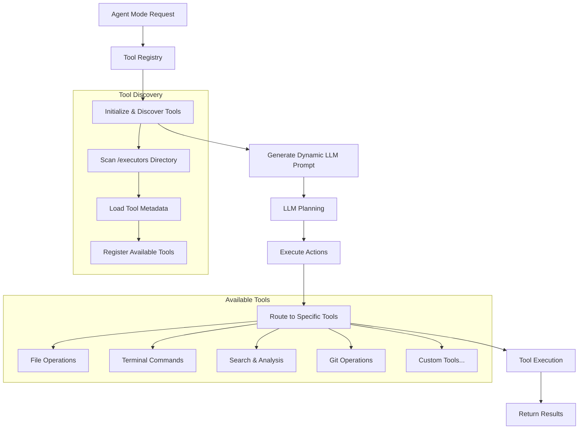

# Modular Tool System

The Cuovare Agent Mode features a revolutionary modular tool system that automatically discovers and integrates capabilities, making it easy to extend the agent with new functionality.

## Architecture Overview

The modular tool system consists of three core components:

### 1. Tool Registry (`src/agent/ToolRegistry.ts`)
The central orchestrator that:
- **Auto-discovers** all available tools at runtime
- **Builds dynamic descriptions** for the LLM
- **Routes execution** to appropriate tools
- **Manages tool metadata** and validation

### 2. Tool Interface (`ToolExecutor`)
A standardized interface that all tools must implement:

```typescript
interface ToolExecutor {
    metadata: ToolMetadata;
    execute(payload: any, context: ExecutionContext): Promise<ExecutionResult>;
}
```

### 3. Individual Tools (`src/agent/executors/`)
Modular tool implementations that handle specific capabilities:
- `FileOperationTool.ts` - File operations
- `TerminalTool.ts` - Command execution  
- `SearchTool.ts` - Code analysis and search
- `GitTool.ts` - Version control operations

## How It Works



## Tool Metadata Structure

Each tool defines comprehensive metadata that enables dynamic discovery and LLM integration:

```typescript
interface ToolMetadata {
    name: string;           // Unique tool identifier
    description: string;    // What the tool does
    category: string;       // Tool category for organization
    parameters?: {          // Expected parameters
        name: string;
        description: string;
        required: boolean;
        type: string;
    }[];
    examples?: string[];    // Usage examples for the LLM
}
```

## Adding New Tools

### Step 1: Create Tool Implementation

Create a new file in `src/agent/executors/`:

```typescript
// src/agent/executors/DatabaseTool.ts
import { ToolExecutor, ToolMetadata } from '../ToolRegistry';

export class DatabaseTool implements ToolExecutor {
    public metadata: ToolMetadata = {
        name: 'database_operation',
        description: 'Execute database queries and manage data operations',
        category: 'Database',
        parameters: [
            { 
                name: 'operation', 
                description: 'Database operation: query, insert, update, delete', 
                required: true, 
                type: 'string' 
            },
            { 
                name: 'sql', 
                description: 'SQL statement to execute', 
                required: true, 
                type: 'string' 
            },
            { 
                name: 'connection', 
                description: 'Database connection string', 
                required: false, 
                type: 'string' 
            }
        ],
        examples: [
            'Query users: { "operation": "query", "sql": "SELECT * FROM users LIMIT 10" }',
            'Insert data: { "operation": "insert", "sql": "INSERT INTO users (name) VALUES (\'John\')" }'
        ]
    };

    async execute(payload: any, context: {
        workspaceRoot: string;
        outputChannel: vscode.OutputChannel;
        onProgress?: (message: string) => void;
    }): Promise<{ success: boolean; message: string; data?: any }> {
        try {
            context.onProgress?.(`Executing ${payload.operation} operation`);
            
            // Your implementation here
            // Connect to database, execute operation, return results
            
            return { 
                success: true, 
                message: `Database operation completed successfully` 
            };
        } catch (error) {
            const errorMessage = error instanceof Error ? error.message : String(error);
            context.outputChannel.appendLine(`Database operation failed: ${errorMessage}`);
            return { success: false, message: errorMessage };
        }
    }
}

export default new DatabaseTool();
```

### Step 2: That's It!

The tool registry will automatically:
- ✅ Discover your new tool
- ✅ Include it in LLM prompts
- ✅ Route requests to your tool
- ✅ Handle execution and error reporting

## Built-in Tools

### File Operations (`file_operation`)
**Category:** File Operations

Handles all file system operations:
- `read` - Read file contents
- `write` - Write/overwrite file
- `create` - Create new file
- `delete` - Remove file

**Example:**
```json
{
    "type": "file_operation",
    "payload": {
        "operation": "create",
        "filePath": "src/utils/helper.ts",
        "content": "export const formatDate = (date: Date) => date.toISOString();"
    }
}
```

### Terminal Commands (`terminal`)
**Category:** Development Tools

Executes safe terminal commands:
- npm/yarn/pnpm commands
- git operations
- build tools (tsc, eslint, etc.)
- test runners

**Example:**
```json
{
    "type": "terminal",
    "payload": {
        "command": "npm",
        "args": ["run", "test"],
        "timeout": 30000
    }
}
```

### Search & Analysis (`search_analysis`)
**Category:** Code Analysis

Performs intelligent code searches:
- `keyword` - Text-based search
- `pattern` - Regex pattern matching
- `file` - Find files by name

**Example:**
```json
{
    "type": "search_analysis",
    "payload": {
        "query": "authentication",
        "type": "keyword",
        "maxResults": 10
    }
}
```

### Git Operations (`git_operation`)
**Category:** Version Control

Manages git repository operations:
- `status` - Check repository status
- `commit` - Commit changes
- `branch` - Branch management
- `push`/`pull` - Remote operations

**Example:**
```json
{
    "type": "git_operation",
    "payload": {
        "operation": "commit",
        "message": "feat: add user authentication",
        "files": ["src/auth/"]
    }
}
```

## LLM Integration

The tool registry automatically generates comprehensive tool descriptions for the LLM:

```
Available Tools:

## File Operations

### file_operation
Perform file operations like read, write, create, delete, edit, copy, and move files

Parameters:
- operation (string) (required): Type of operation: read, write, create, delete, edit, copy, move
- filePath (string) (required): Path to the file (relative to workspace)
- content (string) (optional): Content for write/create/edit operations

Examples:
- Read a file: { "operation": "read", "filePath": "src/index.ts" }
- Create a new file: { "operation": "create", "filePath": "src/utils.ts", "content": "export const helper = () => {};" }

## Development Tools

### terminal
Execute terminal commands safely with configurable environment and timeout
...
```

## Benefits

### 🚀 **Rapid Development**
- Add new capabilities in minutes
- No core agent modifications required
- Plug-and-play architecture

### 🧠 **LLM-Aware**
- Automatic tool discovery for AI planning
- Rich parameter descriptions and examples
- Dynamic capability advertisement

### 🔧 **Maintainable**
- Clear separation of concerns
- Consistent error handling
- Standardized interfaces

### 🎯 **Extensible**
- Support for any tool type
- Custom parameter validation
- Flexible execution contexts

## Best Practices

### Tool Design
1. **Single Responsibility**: Each tool should handle one specific domain
2. **Rich Metadata**: Provide comprehensive descriptions and examples
3. **Error Handling**: Always catch and report errors gracefully
4. **Progress Updates**: Use context.onProgress for long-running operations

### Parameter Design
1. **Clear Naming**: Use descriptive parameter names
2. **Type Safety**: Specify accurate parameter types
3. **Required vs Optional**: Mark parameters appropriately
4. **Validation**: Validate inputs before processing

### Testing
1. **Unit Tests**: Test tool logic independently
2. **Integration Tests**: Test with agent mode
3. **Error Cases**: Test failure scenarios
4. **Edge Cases**: Handle unusual inputs gracefully

## Advanced Features

### Custom Categories
Organize tools by domain:
```typescript
metadata: {
    category: 'Machine Learning',  // Custom category
    // ...
}
```

### Complex Parameters
Support structured data:
```typescript
parameters: [
    {
        name: 'config',
        description: 'Configuration object',
        required: true,
        type: 'object'
    }
]
```

### Tool Dependencies
Tools can interact with each other through the registry:
```typescript
async execute(payload: any, context: ExecutionContext) {
    // Get another tool
    const searchTool = toolRegistry.getTool('search_analysis');
    const searchResult = await searchTool.execute(searchPayload, context);
    // Use search results...
}
```

## Troubleshooting

### Tool Not Discovered
- Check file is in `src/agent/executors/`
- Ensure default export with metadata
- Verify metadata structure
- Check console for loading errors

### LLM Not Using Tool
- Add clear examples to metadata
- Improve tool description
- Check parameter descriptions
- Verify tool name matches LLM expectations

### Execution Errors
- Check error handling in tool
- Verify parameter validation
- Review workspace permissions
- Check output channel for details

## Future Enhancements

- **Tool Versioning**: Support multiple tool versions
- **Conditional Tools**: Enable/disable based on environment
- **Tool Composition**: Chain tools automatically
- **Performance Monitoring**: Track tool usage and performance
- **Remote Tools**: Support distributed tool execution

The modular tool system makes Cuovare's Agent Mode infinitely extensible while maintaining simplicity and reliability. Add any capability you need - the agent will automatically learn to use it!
